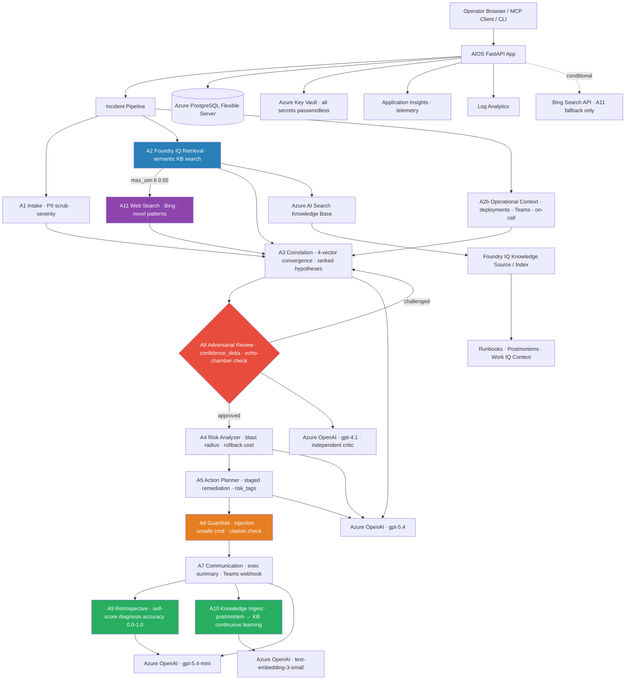

# AIOS Architecture

## Runtime Notes

- The web application runs on Azure App Service with a user-assigned managed identity.
- Secrets are written to Key Vault and then injected into App Service settings.
- Foundry IQ retrieval is implemented through Azure AI Search knowledge base APIs using the `retrieve` endpoint.
- The bootstrap PowerShell script creates the search index, uploads repository knowledge, creates the knowledge source, and creates the knowledge base.
